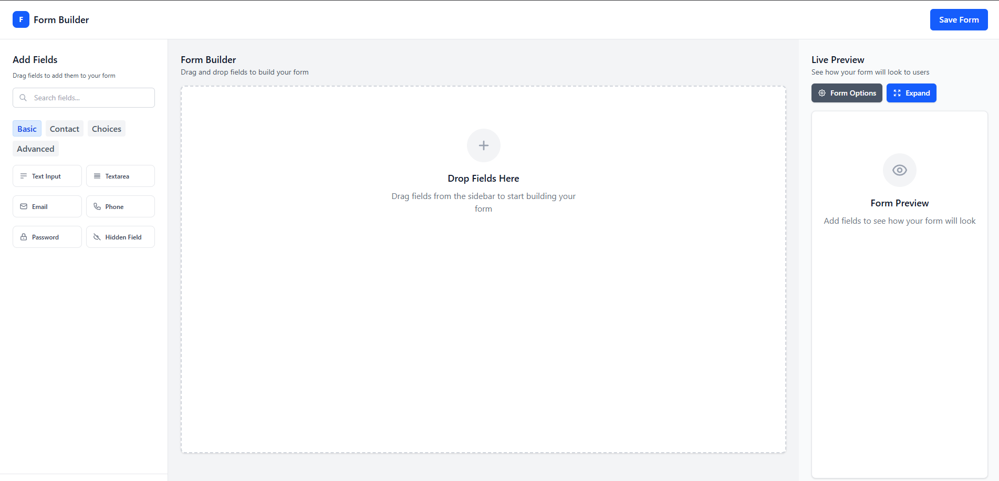

# 🎯 Drag & Drop Form Builder

A powerful, intuitive drag-and-drop form builder built with React, featuring real-time preview, extensive customization options, and robust security features.



## ✨ Features

### 🎨 **Visual Form Building**
- **Drag & Drop Interface**: Intuitive field placement with visual feedback
- **Real-time Preview**: See your form as users will experience it
- **Responsive Design**: Forms automatically adapt to different screen sizes
- **Live Editing**: Modify fields without losing your progress


### ⚙️ **Customization Options**

#### Field Configuration
- **Layout Control**: Full, Half, Third, Quarter width options
- **Size Variants**: Small, Medium, Large field sizes
- **Validation Rules**: Required fields, min/max length, pattern matching
- **Custom Styling**: CSS classes, inline styles
- **Help Text**: Contextual guidance for users

#### Form Styling
- **Color Customization**: Buttons, text, borders, backgrounds
- **Typography**: Font colors for labels, placeholders, inputs
- **Button Styling**: Custom submit button appearance
- **Theme Options**: Light/dark mode support

#### Behavior Settings
- **Validation Timing**: On blur, on submit, or real-time
- **Error Handling**: Custom error messages and highlighting
- **Success Actions**: Redirect URLs, thank you messages
- **Auto-save**: Draft saving capabilities

### 🔒 **Security Features**
- **XSS Protection**: Input sanitization and validation
- **CSRF Prevention**: Built-in security measures
- **Rate Limiting**: Prevents spam submissions
- **Content Security Policy**: Safe content handling
- **Input Validation**: Server-side and client-side validation

### 📱 **Export Options**
- **HTML + CSS + JavaScript**: Complete standalone form
- **React Component**: Ready-to-use React code
- **Vue Component**: Vue.js integration
- **JSON Schema**: Form structure data
- **Embed Code**: iframe integration

## 🚀 Quick Start

### Prerequisites
- Node.js 18+ 
- npm or yarn package manager

### Installation

1. **Clone the repository**
```bash
git clone https://github.com/yourusername/drag-and-drop-form-builder.git
cd drag-and-drop-form-builder
```

2. **Install dependencies**
```bash
npm install
# or
yarn install
```

3. **Start development server**
```bash
npm run dev
# or
yarn dev
```

4. **Open in browser**
Navigate to `http://localhost:5173`

### Production Build
```bash
npm run build
# or
yarn build
```

## 🎯 Usage Guide

### Building Your First Form

1. **Add Fields**: Drag field types from the sidebar to the form canvas
2. **Configure Fields**: Click the edit icon to modify labels, validation, and options
3. **Customize Layout**: Use field options to set width and positioning
4. **Preview Form**: Use the live preview to test your form
5. **Style Form**: Access Form Options to customize colors and appearance
6. **Export**: Choose your preferred export format

### Field Configuration

Each field can be customized with:

- **Basic Settings**: Label, placeholder, default value, help text
- **Validation**: Required fields, length limits, pattern matching
- **Layout**: Width (full, half, third, quarter), size (small, medium, large)
- **Behavior**: Disabled state, conditional logic
- **Styling**: Custom CSS classes

### Form Options

Access comprehensive form settings:

- **General**: Title, description, button text, messages
- **Styling**: Colors, fonts, spacing, themes
- **Behavior**: Redirects, auto-save, progress indicators
- **Validation**: Error handling, validation timing
- **Export**: Output format and inclusion options

## 🏗️ Project Structure

```
src/
├── components/
│   ├── FormBuilder.jsx         # Main form builder component
│   ├── FormCanvas.jsx          # Drag & drop canvas
│   ├── FormElementsPalette.jsx # Field types sidebar
│   ├── SortableFormElement.jsx # Individual form fields
│   ├── EditFieldModal.jsx      # Field editing modal
│   ├── FieldOptionsModal.jsx   # Field options modal
│   ├── FormOptionsModal.jsx    # Form-wide settings
│   ├── LivePreview.jsx         # Real-time form preview
│   ├── PreviewModal.jsx        # Full-screen preview
│   ├── Header.jsx              # Application header
│   ├── Sidebar.jsx             # Left sidebar container
│   └── StarRating.jsx          # Star rating component
├── utils/
│   └── security.js             # Security utilities
└── App.jsx                     # Root application component
```

## 🔧 Technical Details

### Built With
- **React 19** - UI framework
- **@dnd-kit** - Drag and drop functionality
- **React Hook Form** - Form validation and handling
- **Tailwind CSS** - Styling framework
- **Vite** - Build tool and development server

### Key Dependencies
```json
{
  "@dnd-kit/core": "^6.3.1",
  "@dnd-kit/sortable": "^10.0.0",
  "react": "^19.1.0",
  "react-hook-form": "^7.58.0",
  "tailwindcss": "^4.1.10"
}
```

### Browser Support
- Chrome 90+
- Firefox 88+
- Safari 14+
- Edge 90+

## 🛠️ Development

### Available Scripts

- `npm run dev` - Start development server
- `npm run build` - Build for production
- `npm run preview` - Preview production build
- `npm run lint` - Run ESLint

### Environment Setup

1. **Node.js**: Ensure you have Node.js 18 or higher
2. **Package Manager**: npm or yarn
3. **IDE**: VS Code recommended with React extensions

### Development Workflow

1. **Feature Development**: Create feature branches from main
2. **Testing**: Test forms in different browsers and devices
3. **Code Quality**: Follow ESLint rules and React best practices
4. **Security**: Validate all inputs and sanitize outputs

## 🤝 Contributing

We welcome contributions! Please follow these steps:

1. **Fork the repository**
2. **Create a feature branch** (`git checkout -b feature/amazing-feature`)
3. **Commit changes** (`git commit -m 'Add amazing feature'`)
4. **Push to branch** (`git push origin feature/amazing-feature`)
5. **Open a Pull Request**

### Contribution Guidelines

- Follow existing code style and patterns
- Add tests for new features
- Update documentation as needed
- Ensure security best practices
- Test across different browsers

### Reporting Issues

- Use GitHub Issues for bug reports
- Include browser version and steps to reproduce
- Provide screenshots when helpful
- Check existing issues before creating new ones

## 📄 License

This project is licensed under the MIT License - see the [LICENSE](LICENSE) file for details.

## 🙏 Acknowledgments

- **@dnd-kit** team for excellent drag & drop functionality
- **Tailwind CSS** for beautiful default styling
- **React Hook Form** for robust form handling
- **Heroicons** for beautiful SVG icons


*If you find this project helpful, please consider giving it a ⭐ on GitHub!*
